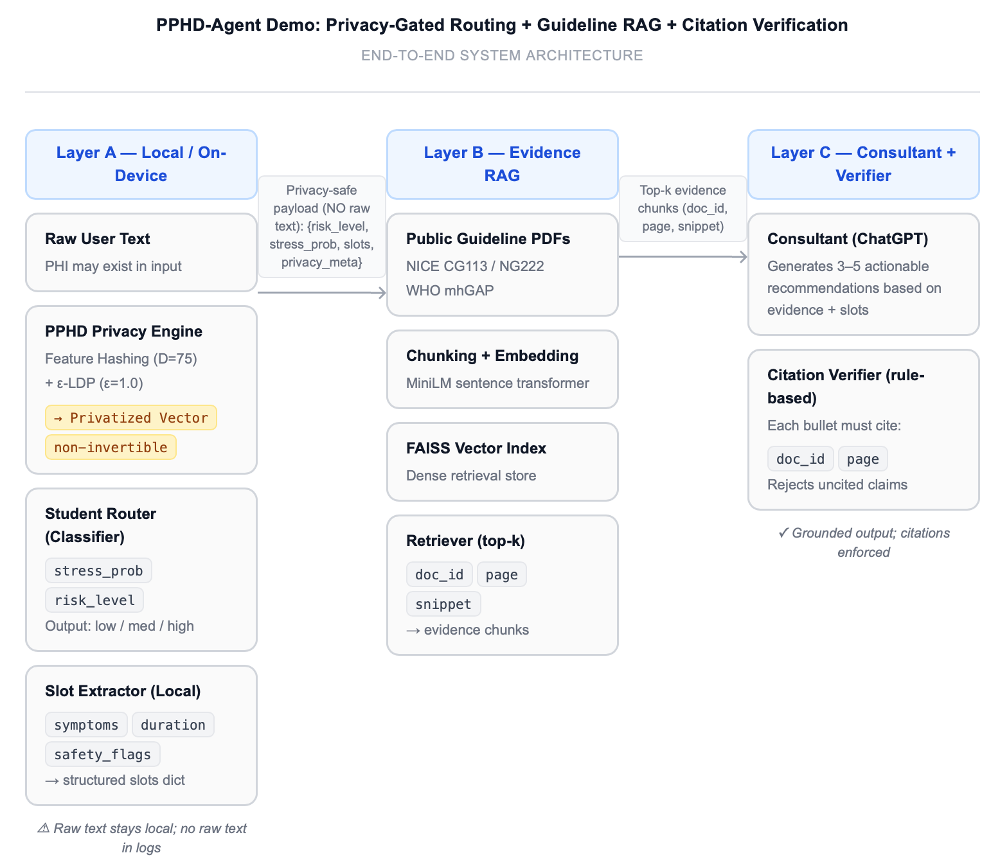
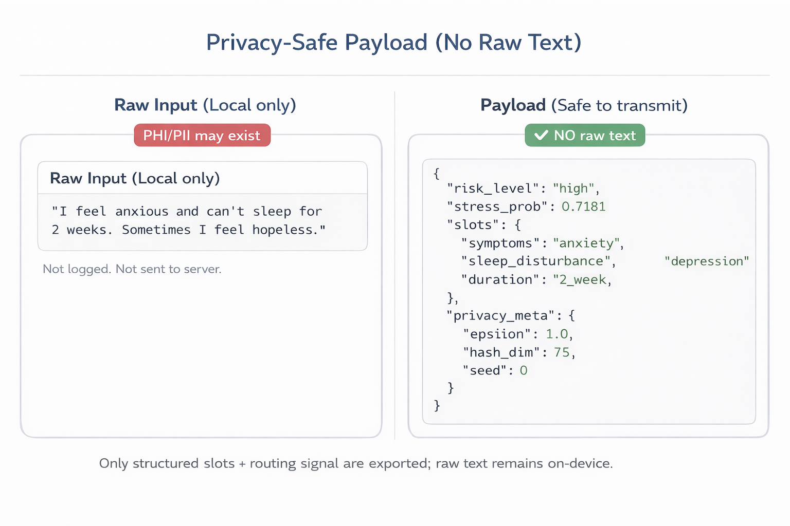
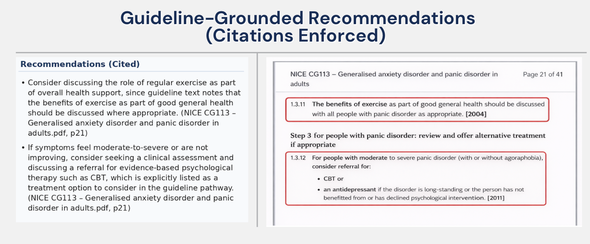

# PPHD Agent: Privacy-Preserving Health Dispatcher
### *An End-to-End Privacy-Gated RAG Workflow for Mental Health Support*

This demo showcases a **three-step pipeline** designed to provide evidence-based mental health recommendations while strictly adhering to data privacy standards (inspired by HIPAA/GDPR). It transforms raw, sensitive user input into an anonymized, feature-rich payload used for grounded retrieval and reasoning.


---

## 🏗 Repository Layout
```text
demo/
├─ notebooks/
│  ├─ Step1_Privacy_Gated_Routing.ipynb          # Local Student Model & Anonymization
│  └─ Step2-3_RAG_Evidence_Synthesis.ipynb       # FAISS Indexing & Cited Recommendations
├─ outputs/
│  ├─ sample_payload.json                        # Anonymized data for downstream use
│  └─ day3_advice.md                             # Final output with mandatory citations
├─ assets/
└─ README.md                                     # Project Documentation


```
---

## PPHD-Agent Architecture

<details>
  <summary>🔍 View: PPHD-Agent System Architecture</summary>
  <br>
  
</details>

## 🚀 The 3-Step Workflow

#### **Step 1: Privacy-Gated Routing**
* **Goal:** Local PII protection and initial risk screening.
* **Mechanism:** Raw Text → **Feature Hashing + ε-LDP** → **Student Classifier**.
* **Key Output:** `risk_level` & `structured_slots`. No raw text leaves the client environment.

<details>
  <summary>🔍 View: Data Anonymization (Raw Text vs. Hashed Payload)</summary>
  <br>
  <p align="center">
    <a href="assets/payload_side_by_side.png">
      
    </a>
  </p>
  <p align="center"><i>Comparison showing how sensitive PII is stripped and replaced by encrypted features.</i></p>
</details>

#### **Step 2: Contextual Retrieval (RAG)**
* **Goal:** Evidence-based grounding using verified clinical guidelines.
* **Mechanism:** Anonymized Slots → **FAISS Vector DB** → Top-K Evidence Retrieval.
* **Key Output:** Contextual snippets with mandatory `doc_id` and `page_number`.


#### **Step 3: Verified Recommendations**
* **Goal:** Traceable, safe, and cited AI advice.
* **Mechanism:** Evidence + Slots → **LLM** → **Citation Verifier**.
* **Key Output:** Actionable advice with hard-coded citations, e.g., `(Source_A, p.12)`.


<details>
  <summary>🔍 View: Grounded Recommendations (Mandatory Citations)</summary>
  <br>
  <p align="center">
    <a href="assets/cited_recommendations.png">
      
    </a>
  </p>
  <p align="center"><i>Final agent response showcasing traceability to clinical source files.</i></p>
</details>
Key Output: Actionable advice with hard-coded citations, e.g., (Source_A, p.12).

